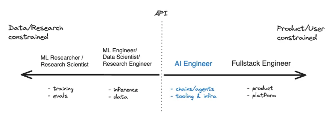
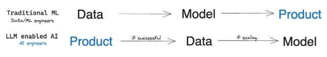
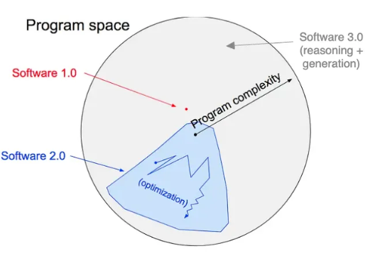

# hugging face 

> 이번 챕터에서는 hugging face를 이용하여 인공지능 모델을 사용해본다.

## 환경설정
> 파이썬의 경우 다양한 버전이 존재하며 이에 따른 라이브러리가 다른데 만약 전역 공간에 이러한 lib를 다운받고 설치하게 되면 lib 충돌 혹은 오류가 발생되며 이를 위해 lib 목록을 하나씩 확인하고 지워야 하는 문제가 발생하게 되어 일반적으로 python을 이용하여 개발을 하는 경우 conda를 통해 환경을 구분하여 개발을 진행한다.

[miniconda](https://docs.conda.io/en/latest/miniconda.htm) : 파이썬의 환경을 분리하기 위해서 anacoda를 사용하였으나 anaconda가 일부 lib를 유료화 하게 되면서 아나콘다의 유료 라이선스를 제외하고 환경을 구성할 수 있도록 만든 환경 설정 툴이다.

[conda-forge](https://conda-forge.org/ ) : 기존 콘다가 유료화 되면서 오픈소스진형에서 무료로 만든 서비스로 miniconda를 이용하면서 conda forge에 있는 lib를 이용하며 라이선스를 위반하지 않는다.

[pytorch](https://pytorch.org/get-started/locally/) : pytorch는 facebook에서 개발한 오픈 소스 딥러닝 프레임워크로 동적 계산 그래프를 사용하여 모델을 정의하고 학습시키는데 강점을 가지고 있으며 이를 사용한 모델을 사용하기 위해서는 local에 pyTorch를 설치해야 한다. 
설치시 gpu / cpu 모드를 선택할 수 있으며 gpu 모델을 이용하면 엔비디아에서 제공하는 cuda unit을 이용하여 연산을 할 수 있다.  토치를 설치하는 것은 conda로 만든 환경에서 설치를 진행해야 한다.

```
엔비디아 그래픽 알아보기 

GeForce 시리즈: GeForce 시리즈는 주로 게임과 일반적인 그래픽 작업에 사용됩니다. 대중적이고 저렴한 가격대의 그래픽 카드로, 게임을 즐기는 사용자들과 일반적인 컴퓨팅 작업을 수행하는 사용자들에게 적합합니다.

Quadro 시리즈: Quadro 시리즈는 전문적인 그래픽 작업을 위해 설계되었습니다. 이 그래픽 카드들은 CAD/CAM, 영화 및 애니메이션 제작, 과학 및 기술적인 시각화 등의 분야에서 사용됩니다. Quadro 시리즈는 높은 정확성과 안정성이 요구되는 작업에 적합합니다.

Tensor 시리즈: Tesla 시리즈는 고성능 컴퓨팅 및 딥러닝 작업을 위해 최적화된 그래픽 처리 장치입니다. 이들은 대규모 데이터 센터나 연구소에서 사용되며, 대규모 계산과 딥러닝 모델 학습을 가속화하는 데 사용됩니다.

RTX 시리즈: RTX 시리즈는 실시간 광선 추적(Ray Tracing) 기능을 제공하는 최신 기술을 탑재한 그래픽 카드입니다. 이 기술은 게임 및 시뮬레이션에서 더욱 현실적인 그래픽을 제공합니다.
```

### 인공지능 이해하기 
[paperswithcode](https://paperswithcode.com/) : 인공지능 모델은 처음 논문을 기반으로 만들어지게 되며 이러한 논문으로 발표된 내용 중 코드로 구현한 내용을 모아놓은 사이트이다.
- Browse State-of-the-Art(sota) : 페이지의 가장 첫 화면에 보여지는 내용으로 가장 최신이면서 우수한 성능을 보여주는 기술이나 방법을 의미한다. 

[arxiv-sanity-lite](https://arxiv-sanity-lite.com/) : AI 논문을 모아놓은 사이트이다. 

> 일반적으로 원하는 모델을 찾아서 코드를 분석하고 벤치마크와 tastk를 확인하여 사용여부를 결정하게 된다.

### paper with code 분석하기
[비디오의 영상과 음성을 함께 분석하는 모델](https://paperswithcode.com/paper/world-model-on-million-length-video-and) 
- code : 논문의 구현 코드를 저장하고 있는 github이다.
- Tasks(작업) : 해당 논문이 해결하고자 하는 특정 작업 또는 문제를 가르치며 주어진 입력 데이터를 분석하고 처리하여 원하는 결과를 얻는 것을 목표로 한다.
- DataSets : 해당 모델을 훈련하고 평하기 위해 사용되는 데이터의 모음을 의미하며 이러한 데이터셋은 일반적으로 입력 데이터와 해당 데이터에 대한 기대 출력 또는 라벨을 포함하고 있다.
- Results from the Paper : 논문에서 보고된 실험 결과를 의미하며 해당 연구에서 사용된 모델이나 알고리즘이 특정 작업이나 문제에 대해 어떤 성능을 보여주었는지 설명하는 자료이다. 해당 연구의 유효성과 기여도를 판단하는데 중요한 역할을 하게된다.

### hugging Face 
> paper with code와 같이 코드로 구현되어 있는 모델을 모아놓은 곳으로 AI의 gitHub로 허깅페이스는 최신 AI 기술을 더 간편하게 활용할 수 있도록 제공되는 플랫폼이며 그 핵심 기술은 트랜스포머(Transformers)이다.

<p>
트랜스포머
자연어 처리 분야에서 사용되는 딥러닝 모델의 하나로 트랜스포머는 <a href="https://arxiv.org/abs/1706.03762">"Attention is All You Need"</a> 라는 논문에서 처음 소개 되었으며 <strong> 기존의 순환 신경망(RNN)이나 장단기 메모리(LSTM)와 같은 구조 대신 Self-Attention 메커니즘을 사용한다.</strong> 이러한 특징으로 인해 트랜스포머는 <mark>문장 내의 단어 간의 관계를 파악하고, 문맥을 이해하는 데 효과적이다.</mark> 트랜스포머는 기계 번역, 텍스트 생성, 질문 응답 등 다양한 자연어 처리 작업에서 좋은 성능을 보이며, 현재 자연어 처리 분야에서 주요한 딥러닝 모델 중 하나로 인정받고 있다.

쉽게 생각하면 컴퓨터가 말하는 방법을 배우는 것과 비슷한 것으로 <mark>문장 속의 단어들이 어떤 관계를 가지고 있는지 파악하고 문장의 뜻을 이해하는데 기술</mark>이다.
</p>

### 시작하기 
```
// 가상환경 만들기
$ conda create -n envName python="version"

// 가상환경 목록 확인
$ conda env list 

// 가상환경 사용하기 
$ conda activate envName 

# 명령어를 잘못선택 했다고 하면 아래의 명령 실행 후 위 내용 실행
$ conda init (windows)
$ conda init bash (mac)

// pytorch에서 pc환경에 맞는 가상 환경을 구성해준다.
$ conda install pytorch torchvision torchaudio pytorch-cuda=11.8 -c pytorch -c nvidia

// pytorch가 설치 되었는지 확인 파이썬 스크립트 작성 후 
$ python CheckCuda.py 

# 실행이 안되는 경우 cuda 설치가 안된 것이다.

$ pip install transformers
$ python transformersCheck.py
# 버전이 나오지 않는 경우 설치가 안된 것이다.

```

### pytorch 확인 사항
- pytorch build :
    - stable : 소프트웨어의 안정성과 신뢰성이 검증된 버전으로 이 버전은 주요한 버그나 문제가 해결되고 충분한 테스트를 거쳐 출시되어 제품의 신뢰성을 보장하기 위해 사용한다.
    - Preview : 미리보기 버전은 최신 기능이나 개선 사항을 포함하고 있지만 충분한 테스트가 진행되지 않은 버전으로 새로운 기능을 미리 체험하기 위해서 사용하며 안정성이 보장되지 않아 특별한 테스트나 개발 환경에서 사용한다.

- Compute Platform : 
    - CUDA 11.8과 CUDA 12.1는 안페어 아키텍처 지원과 머신 러닝 작업 성능차이가 있다. <br>

    - 안페어 아키텍처 <br>
    엔비디아의 3세대 GPU 아키텍처로 2020년 5월에 출시되었다. 이전 세대인 튜링 아키텍처에 비해 상당한 성능 향상과 효율성을 제공하고 딥 러닝, 머신 러닝, 고성능 컴퓨팅(hpc)등 다양한 분야에서 활용되고 있다.
        - 주요 특징
            1. 새로운 RT 코어 : 2세대 RT 코어는 이전 세대보다 약 2배 빠른 실시간 레이 트레이싱 성능을 제공
            2. 새로운 Tensor 코어 : 3세대 Tensor 코어는 이전 세대보다 약 5배 빠른 ai 성능을 제공한다.
            3. 향상된 CUDA 코어 : CUDA 코어는 FP32, FP64, INT 32, INT 8등의 데이터 형식을 지원하고 이전 세대보다 더 높은 성능을 제공한다.
            4. 새로운 메모리 아키텍처 : GDDR6X 메모리는 이전 세대 GDDR6 메모리보다 2배 빠른 속도를 제공한다.
            5. PCIe 4.0 지원 : PCIe 4.0은 이전 세대 PCIe3.0보다 2배 빠른 데이터 전송 속도를 제공한다.
        - CUDA 12.1 사용 조건
            - CUDA 12를 사용하기 위해서는 컴퓨팅 기능 7.0(SM_70) 이상을 지원하는 엔비디아 그래픽 카드에서 사용가능 

### DOCS 분석하기
[hugginFace quicktour](https://huggingface.co/docs/transformers/quicktour) : Hugging Face를 빠르게 사용하기 위해 간략하게 DOCS를 분석한다.

1. Task : 모델에서 해결하고자 하는 문제
2. Description : 모델의 설명
3. Modality : 테스크의 분류
4. Pipeline identifier :  파이프라인을 식별하기 위한 식별자

### 동적 패딩
> 시퀀스 데이터 처리에서 사용되는 기술 중 하나입니다. 이 기술은 각 시퀀스 데이터의 길이가 다를 때 모델에 입력으로 제공하기 전에 시퀀스들을 일괄적으로 동일한 길이로 만드는 방법으로 배치단위로 데이터를 처리할 때 효율적이다.

시퀀스 변환
1. "나는 고양이를 좋아해."
    - [1, 2, 3, 4, 5]
2. "그는 개를 싫어해."
    - [6, 7, 8, 9, 5]
3. "우리는 새를 보았다."
    - [10, 11, 12, 13]

동적 패딩
1. "나는 고양이를 좋아해."
    - [1, 2, 3, 4, 5]
2. "그는 개를 싫어해."
    - [6, 7, 8, 9, 5]
3. "우리는 새를 보았다."
    - [10, 11, 12, 13,0]

위에서 아래의 문장의 "보았다"는 문장의 끝으로 해당 문장의 "."은 토큰으로 취급하지 않는다.

### Pipeline 이란
> 여러 단계로 이루어진 작업을 순차적으로 처리하는 방식을 의미하며 각각의 작업을 수행하는데 필요한 데이터를 입력받아 그 결과를 다음 단계로 전달하여 전체 작업을 구성한다.


### AI 참고하기
[AI 엔지니어](https://www.latent.space/p/ai-engineer)



AI 엔지니어의 경우 우리의 생각과 다르게 AI의 대하여  알지 못해도 중간에 침투할 수 있는 경계 라인이 생겨 있으며 또한 ML을 만드는 엔지니어보다 AI 엔지니어가 훨씬 더 수요가 많을 것이다.

---



과거 AI는 데이터를 먼저 준비하고 Model에 학습을 시켜 제품을 만드는 방식이였으나 현재의 서비스는 이미 만들어진 표준화된 모델을 사용하여 데이터를 모으고 모여진 데이터를 기반으로 model을 훈련하는 방식으로 변하였으며 이를 통해 효율적인 학습이 및 수요 예측이 가능해졌다.



#### 서비스 점유율 알아보기
- Software 1.0 : 프로그램에 AI가 사용되지 않는 가장 일반적인 서비스
- Software 2.0 : AI가 최적화 되어 있는 프로그램
- Software 3.0(예정) : AI 중심으로 이루어진 프로그램


